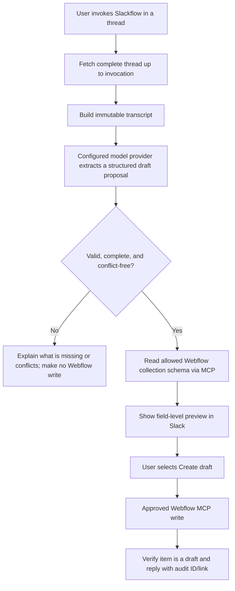
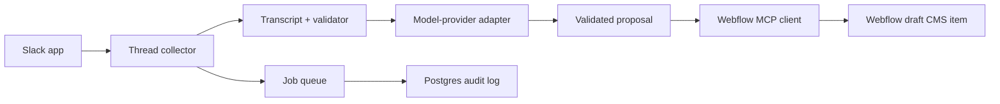

# Slackflow — Product and Implementation Plan

**Status:** local Slack capture and no-write model-proposal milestone implemented; Webflow remains disconnected.  
**Last verified:** 2026-08-15.

## 1. Product goal

Slackflow is one intelligent Slack bot that a user invokes inside a Slack thread, for example:

```text
@Slackflow draft
```

It reads the complete invoked thread, extracts the information needed for a blog post, shows an exact Webflow-field preview, and—only after explicit user approval—creates a **draft** item in a configured Webflow CMS collection.

It does not publish content, delete content, change unrelated Webflow settings, or fill missing data by guessing.

## 2. Scope and non-goals

### In scope

- Read every permitted message in the Slack thread where Slackflow is invoked, in chronological order.
- Use material from all thread participants, not just Reptar.
- Extract or transfer title, body, date, source links, metadata, creative briefs, and explicitly blank fields.
- Identify missing information and conflicting values rather than choosing values silently.
- Create one Webflow CMS item in **draft/staged** state after a Slack approval.
- Work in a dummy Slack channel and staging Webflow site before it connects to production.
- Use a provider-neutral model interface for extraction/planning. The initial tested adapter uses the OpenAI Responses API; Webflow MCP remains the planned Webflow access path, subject to staging validation.

### Not in the first version

- Publishing a Webflow item.
- Updating, deleting, or archiving existing items.
- Creating CMS collections, pages, components, styles, or site settings.
- Publishing a generated image or draft to Webflow without a later explicit approval.
- Reading Slack messages outside the invoked thread.
- Browsing the web to invent or “improve” the article.

## 3. Important content rule

Slackflow never generates article prose from the thread. It uses **strict transfer** only: the model selects exact character-for-character spans from captured messages, then Slackflow validates and derives the transferable fields. There is no compose mode, connecting prose, or model-authored CMS body.

## 4. User flow



### Thread cut-off behavior

- The invocation message defines the cut-off time.
- Slackflow reads source messages from the thread root through the invocation, excluding the invocation command itself.
- Messages posted after invocation are not used by that run.
- All authors in scope are included, except Slackflow’s own earlier messages, identified by both bot user ID and bot ID.
- The current local milestone persists only delivery IDs, command IDs, timestamps, and lifecycle status for duplicate prevention. It never stores transcript text in the run ledger.

### Multiple Reptar replies

Reptar can post multiple replies. They are all included like all other messages. If their values conflict, Slackflow flags the conflict. It does not use an unsafe implicit rule such as “last message wins.”

## 5. Safety gates

The complete thread is **untrusted source material**, not a set of instructions for the agent. A thread may include text such as “ignore all rules” or a previous bot’s command; these must never change Slackflow’s behavior.

The backend enforces these rules independently from the model:

- Only the Slack invocation can authorize a run.
- The target Webflow site and collection are fixed per environment.
- Only known collection fields can be written.
- Required values must be present and valid.
- Explicit blanks remain blank.
- Date, URL, option, and slug formats are checked deterministically.
- Conflicts, missing data, duplicate slugs, and unsupported field types stop the run.
- A user approval is required before any Webflow write.
- The bot has no publish, delete, update, collection-creation, style, page, or Designer-editing capability.
- Slack retries must be idempotent: the same run can create no more than one draft.

## 6. Architecture

Slackflow is one bot/product, implemented as one TypeScript backend with focused internal modules:



### Target core modules

| Module | Responsibility |
|---|---|
| Slack listener | Receive mentions, message shortcuts, and interactive approval buttons. |
| Thread collector | Call Slack for the complete invoked thread and form a chronological transcript. |
| Run store | Persist event ID, transcript hash, state, response ID, approval state, and result. |
| Draft extractor | Call the configured model-provider adapter for strictly structured output. |
| Validator | Enforce field mapping and no-fabrication rules before any write. |
| Webflow MCP adapter | Discover permitted tools, read the configured collection schema, and request draft creation. |
| Approval handler | Turn Slackflow's own approved write request into a Slack Block Kit approval button. |
| Audit/notification | Verify draft status and reply in the same Slack thread. |

## 7. Slack integration

### Primary invocation

Use an in-thread mention:

```text
@Slackflow create a Webflow draft from this thread
```

Also add a message shortcut, **Create Webflow draft**, for a precise contextual entry point.

### Initial scopes

Start with the smallest practical bot scopes:

- `app_mentions:read`
- `chat:write`
- `channels:history` for approved public-channel tests
- `groups:history` for the private sandbox/production channels now in use

Add scopes only after confirming the exact Slack event/API requirements. The bot should be invited to each private channel it reads.

### Event handling

Slack expects acknowledgment within three seconds. The HTTP handler verifies Slack’s signature, stores/deduplicates the event, queues the work, and returns success immediately. The background worker performs thread retrieval and AI/MCP work.

## 8. Model-provider layer

### Provider-neutral design

Slackflow's product logic depends on a small `DraftModelProvider` contract, not on any vendor SDK or agent framework. The contract accepts an immutable transcript and returns the same validated `DraftProposal` shape regardless of provider.

The first adapter is `OpenAiResponsesProvider`, implemented with a direct native `fetch` call to the Responses API and configured by:

```text
LLM_PROVIDER=openai
LLM_MODEL=gpt-5.6-luna
LLM_REASONING_EFFORT=medium
```

An Anthropic or other provider is added later by implementing and testing another native HTTP adapter that returns the same contract. The Slack listener, transcript validator, approval flow, and Webflow writer do not change. Selecting a provider before its adapter exists must fail clearly; it must never silently fall back to a different model.

### What the configured model provider does

- Read the explicit system instruction plus the full transcript.
- Produce a strict JSON proposal—not direct unvalidated Webflow data.
- Select exact source spans for each transferable field; Slackflow itself derives the displayed title/body/metadata from those spans.
- Identify `missing_fields` and `conflicts`; never compose, paraphrase, or rewrite a blog post.
- It never receives Webflow MCP tools or write authority. A separate, deterministic approval-and-writer path handles Webflow only after the proposal is validated and approved.

### Initial OpenAI Responses adapter

Slackflow does **not** use the OpenAI SDK, Agents SDK, or a generic agent framework. The initial adapter uses Node's native `fetch` to make a direct `POST` request to `https://api.openai.com/v1/responses`.

The Slackflow-owned harness is responsible for:

- Building the untrusted thread transcript.
- Sending the system instruction, configured model/reasoning settings, and `store: false` request setting.
- Requiring strict JSON-schema output.
- Parsing and validating the response at runtime.
- Rejecting citations for messages not in the captured thread.
- Blocking any Webflow write until a separate user-approval step exists.

### What no model provider may do

- Treat transcript text as instructions.
- Choose arbitrary Webflow sites, collections, or fields.
- Publish, delete, or update content.
- Make up image URLs, sources, dates, categories, names, or factual claims.

### Required output shape (initial)

```json
{
  "mode": "transfer",
  "status": "ready",
  "source_selections": {
    "title": { "message_timestamp": "...", "exact_text": "..." },
    "body_markdown": [{ "message_timestamp": "...", "exact_text": "..." }],
    "publication_date": null,
    "source_url": null,
    "thumbnail_brief": null,
    "banner_brief": null
  },
  "explicitly_blank": [],
  "missing_fields": [],
  "conflicts": [],
  "notes": [],
  "tag_selection": {
    "selected_tag": "AI Industry",
    "reason": "...",
    "message_timestamps": ["..."]
  }
}
```

`exact_text` must be a character-for-character substring of the timestamped captured Slack message. The application, rather than the model, joins selected body spans with one blank line and derives the CMS proposal fields. The Webflow field mapping will be finalized after inspecting the staging collection.

### Secrets and data handling

- Create a dedicated credential/project for the selected model provider.
- Store the credential in a secret manager; never commit it or paste it into Slack.
- Use separate provider credentials for staging and production.
- Keep application audit records minimal; prefer hashes and message IDs over copying all thread content into logs.

## 9. Webflow MCP

Webflow’s official remote MCP endpoint is:

```text
https://mcp.webflow.com/mcp
```

It uses OAuth. A Webflow admin/site owner will connect an approved workspace/site through an interactive authorization flow. Webflow MCP follows the authorized Webflow user’s roles and permissions, and Webflow records changes in its activity log.

### Required tool policy

Allow only the smallest set of MCP capabilities required for the workflow:

1. Read the configured CMS collection and field schema.
2. Check existing CMS item/slug when needed.
3. Create a CMS item as a draft.

Do not allow publishing, deleting, updating unrelated items, collection creation, page/style/component editing, or asset upload in version 1.

### Write approval

All MCP write calls require Slackflow's own explicit approval gate. Slackflow shows the exact validated draft in Slack, then calls the writer only after the authorized user confirms it.

### Important MCP validation milestone

Before relying on MCP in production, prove in staging that Slackflow can:

- Complete the Webflow OAuth flow from its hosted backend.
- Restrict the available MCP tools successfully.
- Create only draft CMS items.
- Complete Slackflow's independent Slack approval and Webflow write flow.

If that OAuth/MCP service-to-service integration is not reliable, retain the same Slackflow user experience and replace only the internal writer with Webflow’s direct CMS Data API. This is a tested fallback, not a broadened product scope.

### Current implementation constraint

Webflow's `data_cms_tool` groups read, draft creation, update, publish, unpublish, and delete actions under one MCP tool. Slackflow must not offer it to a model as a generic tool. The model produces only a validated proposal; deterministic application code uses a fixed action allowlist and one configured collection after explicit Slack approval. See `WEBFLOW_CMS_INTEGRATION.md` for the schema-first form and write contract.

## 10. Images and attachments

A thumbnail or banner **brief** is not an image asset.

Version 1 stores a supplied brief only in a text field, if the CMS has such a field. It does not create an image field value without an actual approved image URL/file and alt text.

Thread text is included in version 1. Support for Slack files, images, LinkedIn previews, PDFs, or external unfurls will be designed separately, with an explicit data-access and validation policy.

## 11. Environments and testing

| Environment | Slack | Webflow | Model provider | Purpose |
|---|---|---|---|---|
| Local | Slackflow Dev via Socket Mode or fixtures | Fake/mocked API | Dev credential | Fast development and unit tests |
| Staging | Separate Slack workspace/app and `#slackflow-sandbox` | Separate staging site/collection | Staging credential | End-to-end proof |
| Production | Production Slack app | Production site/collection | Production credential | Real drafts |

### Dummy-channel tests

No Reptar connection is needed to start.

In `#slackflow-sandbox`, create dummy multi-message threads from normal test users or a small Mock Reptar app. Invoke Slackflow after the test messages. Required cases:

- Valid multi-message thread.
- Several authors contributing information.
- Existing draft plus metadata in different replies.
- Missing required title/body/date.
- Conflicting titles or dates.
- Explicit blank fields.
- Prompt injection text in the thread.
- Duplicate invocation or Slack retry.
- Webflow API/MCP failure.
- Verify created CMS item is `isDraft: true` and never published.

## 12. Hosting

### Local development

Use Socket Mode so Slack can deliver events to a local running process without a public URL.

### Staging and production recommendation

Use HTTP events hosted on Google Cloud:

- **Cloud Run service:** Slack webhook and interactive-action endpoints.
- **Cloud Tasks:** background jobs and retry behavior.
- **Cloud SQL/Postgres:** idempotency, approval state, and audit records.
- **Secret Manager:** Slack, selected model-provider, and Webflow OAuth secrets/tokens.
- **Cloud Logging/Monitoring:** errors, failed runs, and alerts.

The Slack endpoint is public so Slack can call it, but every request must be verified using the Slack signing secret. Worker-to-worker endpoints remain authenticated.

## 13. Required configuration values

Do not create or share these in chat. Store them in local `.env` files only for local development, and a secret manager for hosted environments.

```text
SLACK_SIGNING_SECRET=
SLACK_BOT_TOKEN=
SLACK_APP_TOKEN=             # local Socket Mode only
LLM_PROVIDER=openai
LLM_MODEL=gpt-5.6-luna
LLM_REASONING_EFFORT=medium
OPENAI_API_KEY=
SLACKFLOW_STATE_PATH=.slackflow/state.sqlite
WEBFLOW_MCP_URL=https://mcp.webflow.com/mcp
WEBFLOW_OAUTH_CLIENT_ID=
WEBFLOW_OAUTH_CLIENT_SECRET=
# DATABASE_URL=                 # future shared hosted run store, if horizontally scaled
# QUEUE_CONFIGURATION=          # future hosted worker, not used by the local milestone
```

## 14. Build sequence

1. Create a Slack test workspace/app and a dummy sandbox channel.
2. Scaffold the TypeScript Slackflow application and add local Socket Mode.
3. Implement full-thread capture and display the immutable transcript in Slack/logs.
4. Add fixtures and automated tests for multi-message dummy threads.
5. Inspect and record the exact staging Webflow CMS collection schema.
6. Add structured extraction through the configured model-provider adapter, validation, and preview—still no write capability.
7. Complete Webflow MCP OAuth in staging; allow only schema reads and draft creation.
8. Add Slack approval buttons and the MCP approval loop.
9. Prove the dummy-channel end-to-end flow creates only staging drafts.
10. Deploy staging to Cloud Run, then configure a separate production app/site after approval.

## 15. First user action

Create a **new Slack app in a test Slack workspace** named `Slackflow Dev`. Enable a bot user and Socket Mode; do not add production credentials or Webflow access yet. The exact setup steps are provided in the working session after this document is created.

## 16. Source references

- Slack Events API: https://docs.slack.dev/apis/events-api/
- Slack thread retrieval: https://docs.slack.dev/messaging/retrieving-messages/
- Slack agent development: https://docs.slack.dev/ai/developing-agents/
- OpenAI Responses API quickstart: https://platform.openai.com/docs/quickstart/make-your-first-api-request
- GPT-5.6 Luna model: https://developers.openai.com/api/docs/models/gpt-5.6-luna
- Webflow MCP getting started: https://developers.webflow.com/mcp/reference/getting-started
- Webflow MCP architecture: https://developers.webflow.com/mcp/reference/how-it-works
- Webflow MCP data tools: https://developers.webflow.com/mcp/tools/data-tools
- Webflow CMS publishing states: https://developers.webflow.com/data/docs/working-with-the-cms/publishing
